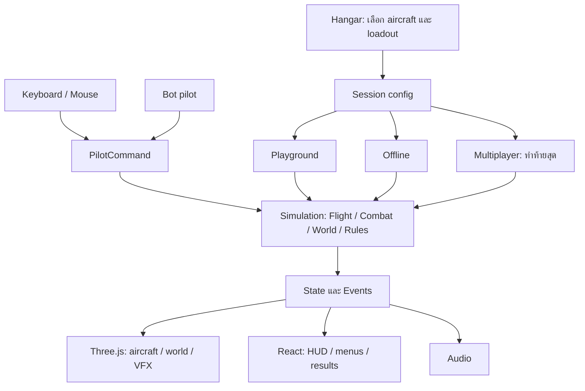

# Project Maverick — Master Plan

> ฉบับเสนอเพื่อเริ่มพัฒนา · 6 กันยายน 2026 · เอกสารภาษาไทย · เกม React + Three.js
> ชุดนี้เป็นแผนงาน ยังไม่ได้เปลี่ยนโค้ดเกมหรือยืนยันว่าค่าทดลองผ่าน playtest แล้ว

## 1. เกมที่เราจะสร้าง

เกมเครื่องบินรบ **Arcade dogfight บน Desktop browser** ที่ใช้เมาส์และคีย์บอร์ด เรียนรู้การบินพื้นฐานได้เร็ว แต่มีพื้นที่ให้ฝึกการรักษาความเร็ว เลี้ยวหลอก ยิงปืน และใช้ maneuver ผู้เล่นเลือกเครื่องบินจากโรงเก็บที่ดูโมเดล `.glb` อาวุธ ความรู้จริง และสมรรถนะในเกมได้ ก่อนเข้า Playground หรือ Offline กับบอท ส่วน Multiplayer ทำหลัง Offline เล่นสนุกและระบบนิ่งแล้ว

ใช้ความคล่องตัวและความเข้าถึงง่ายของเกมแนว Battlefield เป็นแรงบันดาลใจ ไม่ถือว่าแผนนี้อธิบายกลไกภายในของ Battlefield 6 และไม่พยายามจำลองเครื่องจริงทุกระบบ

หลักสำคัญ:

1. **ยิงกันได้จริง:** บีบช่วงความเร็วในการเคลื่อนที่ให้ระยะยิงปืนมีเวลาเล็ง ใช้เสียง กล้อง และ VFX เสริมความเร็ว
2. **บังคับง่าย แต่มีต้นทุน:** W/S เพิ่ม/ลดความเร็วเป้าหมาย; High-G และ Cobra แลกความเร็วกับโอกาสยิง
3. **แต่ละลำมีเหตุผลให้เลือก:** ไม่มีลำใดเก่งที่สุดทุกด้าน ความรู้จริงแยกจากค่าบาลานซ์ชัดเจน
4. **ระบบเดียวใช้ได้หลายโหมด:** ผู้เล่นและบอทส่งคำสั่งรูปแบบเดียวกัน; UI และโมเดลอ่านผลจาก simulation
5. **โค้ดตรงไปตรงมา:** TypeScript แบบไม่เล่นท่ายาก ฟังก์ชันกับข้อมูล แยกตามหน้าที่ ไม่เริ่มด้วย framework เกมที่สร้างเอง

## 2. ขอบเขตและสมมติฐานที่ใช้วางแผน

| เรื่อง | ข้อเสนอเริ่มต้น |
|---|---|
| เทคโนโลยี | React + TypeScript + Vite + Three.js ผ่าน React Three Fiber ซึ่งตัวอย่างใช้อยู่แล้ว |
| เครื่องบิน | F-22 เป็นลำทดลองแรก; เป้าหมาย Offline release มี F-22, Su-57, F/A-18E Super Hornet |
| คำว่า F18 | เลือก F/A-18E เป็น baseline ที่ชัดเจน ไม่ปนกับ F/A-18C หรือ F/A-18F |
| ภาษา | ไทย `th` และอังกฤษ `en` ตั้งแต่ foundation |
| อุปกรณ์ | Mouse + Keyboard และ Keyboard-only; gamepad/mobile เลื่อนออกไป |
| การเริ่มบิน | เกิดกลางอากาศ ไม่ต้องทำ taxi, takeoff, landing หรือ cockpit ที่กดสวิตช์ได้ใน MVP |
| Offline | Local simulation ไม่มี backend หลังโหลด asset ที่จำเป็นแล้ว; การเปิดเว็บใหม่โดยไม่มีเน็ตต้องเพิ่ม cache/PWA ภายหลัง |
| Multiplayer | ออกแบบขอบเขตไว้ก่อน; ทำ server/rooms/network จริงท้ายสุด เริ่มพิสูจน์ 1v1 ก่อนเพิ่มจำนวนผู้เล่น |
| โลก | สนามฝึกเรียบหนึ่งสนามก่อน ต่อด้วยแผนที่ dogfight หนึ่งแผนที่ |
| การปลดล็อก | เลือกทุกเครื่องที่พร้อมเล่นได้เลย ยังไม่ทำ economy, grind หรือ progression |

นี่เป็นข้อเสนอใหม่ตามคำขอปัจจุบัน ไม่สืบทอดชื่อเกมใหม่ ที่ตั้ง repo หรือคำตอบของผู้ใช้ที่ถูกบันทึกไว้ในเอกสารเก่าโดยอัตโนมัติ ยังไม่สร้างโปรเจกต์ข้างเคียงหรือย้ายไฟล์ต้นฉบับ

## 3. อ่านและแก้เอกสารอย่างไร

Master นี้เป็นเจ้าของขอบเขต ลำดับงาน และเงื่อนไขส่งมอบ ส่วนรายละเอียดมีเจ้าของเพียงไฟล์เดียว:

| เอกสาร | เป็นเจ้าของเรื่อง |
|---|---|
| [01 Architecture](docs/game-design/01-architecture.md) | โครงสร้างโค้ด, state, command, event, game loop |
| [02 Controls](docs/game-design/02-controls.md) | ปุ่มหลัก, mouse/keyboard, rebinding, input conflicts |
| [03 Flight & Speed](docs/game-design/03-flight-and-speed.md) | แบบจำลองบิน, W/S, ความเร็วและหน่วย, energy |
| [04 Maneuvers](docs/game-design/04-maneuvers.md) | High-G, Airbrake, Cobra, PSM, thrust vectoring |
| [05 Aircraft](docs/game-design/05-aircraft.md) | ข้อมูลรายลำ, ความแตกต่าง, บาลานซ์, facts |
| [06 Hangar](docs/game-design/06-hangar.md) | เลือกเครื่อง, ดู 3D, อาวุธ, ความรู้ |
| [07 Weapons & Damage](docs/game-design/07-weapons-and-damage.md) | ปืน, missile, lock, countermeasure, hit, kill |
| [08 Bots](docs/game-design/08-bots.md) | AI pilot, perception, difficulty |
| [09 Offline](docs/game-design/09-offline.md) | match lifecycle, scoring, spawn, pause |
| [10 Playground](docs/game-design/10-playground.md) | ฝึกบิน, tutorial, flight lab, tuning workflow |
| [11 Cameras](docs/game-design/11-cameras.md) | horizon lock, aircraft-follow, free look, transitions |
| [12 HUD & Feedback](docs/game-design/12-hud-and-feedback.md) | HUD, menus, accessibility, เสียงและ VFX |
| [13 Assets](docs/game-design/13-assets.md) | GLB pipeline, rig, load, cache, resource lifecycle |
| [14 World](docs/game-design/14-world.md) | หน่วยโลก, terrain, collision, ขอบสนาม |
| [15 Localization & Settings](docs/game-design/15-localization-and-settings.md) | สองภาษา, save schema, settings migration |
| [16 Multiplayer](docs/game-design/16-multiplayer.md) | server authority, commands/snapshots, prediction |
| [17 Quality & Balance](docs/game-design/17-quality-and-balance.md) | acceptance tests, performance, playtest |
| [18 Migration & Backlog](docs/game-design/18-migration-and-backlog.md) | วิเคราะห์โค้ดเดิม, งานเรียงลำดับ, จุดหยุดตรวจ |
| [19 Sources & Decisions](docs/game-design/19-sources-and-decisions.md) | แหล่งข้อมูล, ข้อเสนอที่ต่างจากเอกสารเก่า, decision log |

เมื่อแก้ปุ่มให้แก้ 02; เมื่อแก้ความเร็วให้แก้ 03 และ profile ในโค้ด ไม่คัดลอกตารางซ้ำทุกโหมด ถ้าเอกสารเก่าขัดกัน ให้ใช้ชุดนี้สำหรับงานใหม่และบันทึกเหตุผลใน 19 ค่าตัวเลขทั้งหมดที่ระบุว่า “ทดลอง” เป็น gameplay tuning ไม่ใช่ข้อเท็จจริงทางการบิน

## 4. ภาพรวมระบบ

ทุกเครื่องมี entity ของตัวเอง แต่มี **ตัวขับเวลา simulation เพียงตัวเดียวต่อ session** Camera ไม่มีสิทธิ์หมุนเครื่องบิน; GLB animation ไม่มีสิทธิ์ตัดสินว่ากระสุนโดน; component ไม่ตัดสิน respawn

## 5. Roadmap และจุดตัดสินใจ

สถานะ implementation 6 ก.ย. 2026: P0 และ P1 baseline อยู่ในแอปรากแล้ว ดู [Roadmap/ผลส่งมอบ Phase 1](docs/phase-1-flight-slice.md) สำหรับงานที่ทำจริง การตรวจ และ gate ที่ยังต้อง playtest ข้อความแผนในส่วนอื่นยังเป็นเป้าหมายของเกมเต็ม

ไม่กำหนดวันที่เสร็จจากการเดา ก่อนเริ่มแต่ละ phase ให้แตกงานใน 18 และประเมินจากความเร็วทำงานจริง จบ phase เมื่อผ่าน gate ไม่ใช่เมื่อมี UI ให้เห็นเท่านั้น

| Phase | ผลงานที่เล่น/ตรวจได้ | Dependencies | Exit gate |
|---|---|---|---|
| P0 Foundation | runtime กลาง, content schema, ภาษา, session, บันทึก baseline เดิม | ไม่มี | เปิด headless world ได้; mount/unmount ไม่สร้าง loop ซ้ำ |
| P1 Flight slice | F-22 บินในสนามเรียบ, W/S, pitch/yaw/roll, กล้องสอง roll modes | P0 | ควบคุมได้ทั้งสอง input presets; 30/60/144 FPS ไม่เปลี่ยนผลบิน |
| P2 Playground & maneuver | ฝึก Airbrake, High-G, Cobra, telemetry, recovery | P1 | nose/path แยกกันจริง; ใช้ท่าแล้วมี cost; มือใหม่กลับมาบินปกติได้ |
| P3 Hangar & aircraft | โรงเก็บ, facts/game tabs, loadout, profile อย่างน้อยสองลำ | P1–P2 + asset pipeline | เพิ่ม profile โดยไม่เพิ่มเงื่อนไขชื่อเครื่องใน flight core |
| P4 Gun duel | ปืน, damage, respawn, บอทไล่/หนีหนึ่งตัว | P2; ใช้ F-22 mirror ได้ | เล่น guns-only 1v1 ครบหนึ่ง match; มีเวลาเล็งและยิงได้ |
| P5 Offline combat | missile IR, lock, flares, bot tactics, results | P4 | ยิง/หลบ/แพ้/ชนะ/เริ่มใหม่ได้ครบ; ไม่ต้องเรียก backend |
| P6 Offline release | สามลำ, สนาม dogfight, settings สองภาษา, polish/performance | P3 + P5 | checklist ใน 17 ผ่าน; aircraft แต่ละลำมี counterplay |
| P7 Multiplayer | server 1v1 → rooms → 2v2 หาก benchmark ผ่าน | **P6 เท่านั้น** | server ตัดสิน hit/score, latency tests ผ่าน, version mismatch จัดการได้ |

เริ่ม combat ด้วย F-22 mirror ได้หาก Su-57/F/A-18E asset ยังไม่พร้อม แต่ P6 จะไม่ถือว่าครบ roster จนมีโมเดลและ rig ผ่านการตรวจ หากต้องการเพิ่ม radar missile ให้ทำหลัง IR loop ผ่าน ภายใน P6 หรืออัปเดตหลัง Offline release โดยไม่บล็อกปืน/IR

## 6. Definition of Done ระดับเกม

- เข้าโรงเก็บ เลือกหนึ่งในสามลำ เปิดข้อมูลจริงและ status ในเกม ดูอาวุธ แล้วเริ่มบินได้
- W/S ไม่ใช่ throttle โดยตรง; ไม่ผูกการเปลี่ยนความเร็วกับ FPS
- มีทั้ง normal turn, Airbrake, High-G และ Cobra สำหรับลำที่รองรับ พร้อมวิธี recover
- ยิงปืนและ missile กับบอทได้ มี damage, death, respawn, score และจบ match
- Playground ฝึกได้โดยไม่บังคับให้เข้า match; pause/reset/retry ทำงานครบ
- กล้องล็อคขอบฟ้าและหมุนตามเครื่องไม่เปลี่ยนสมรรถนะหรือคำสั่งบิน
- ไทย/อังกฤษครอบคลุมเส้นทางหลัก การตั้งค่า บทสอน ข้อผิดพลาด และผลการเล่น
- Simulation ทดสอบโดยไม่มี Canvas ได้ และเพิ่มเครื่องบินที่ใช้กลไกเดิมผ่านข้อมูลได้
- Multiplayer ยังไม่ต้องมีใน Offline release แต่ core ไม่อ่าน DOM, React หรือ WebSocket

## 7. ความเสี่ยงที่ต้องพิสูจน์ก่อนขยาย

| ความเสี่ยง | สิ่งที่จะทำให้รู้เร็ว |
|---|---|
| ความเร็วสวยแต่ยิงไม่โดน | P4 gun duel วัด firing window, target visibility, เวลา re-engage |
| Cobra กลายเป็นปุ่มชนะฟรี | วัด nose rotation กับ path rotation และช่วงเสียเปรียบหลังท่า |
| ไล่แก้ค่าสมจริงจน flight model โตไม่หยุด | จำกัด profile เป็นกลุ่มพารามิเตอร์ที่อธิบายได้; ปรับทีละกลุ่มจาก scenario |
| ทุกลำต่างแค่ skin | ใช้ bot script เดียวกันวัด turn, acceleration, PSM cost และ recovery |
| GLB หนักเมื่อมีหลายเครื่อง | ใช้ gameplay LOD ตั้งแต่ P3 และ benchmark หลาย entity ก่อนทำสนามสวย |
| แยกไฟล์แต่ยังพันกัน | ตรวจ dependency และผู้เขียน state; ห้าม renderer เรียก damage/reset โดยตรง |

งานเริ่มต้นที่แนะนำ: ทำ P0 และ P1 ให้ได้เครื่องบินหนึ่งลำที่บินด้วย command ใหม่ในสนามเรียบ จากนั้นตัดสิน flight feel ก่อนเพิ่ม content จำนวนมาก ดู [backlog ที่ลงมือทำต่อได้](docs/game-design/18-migration-and-backlog.md)
