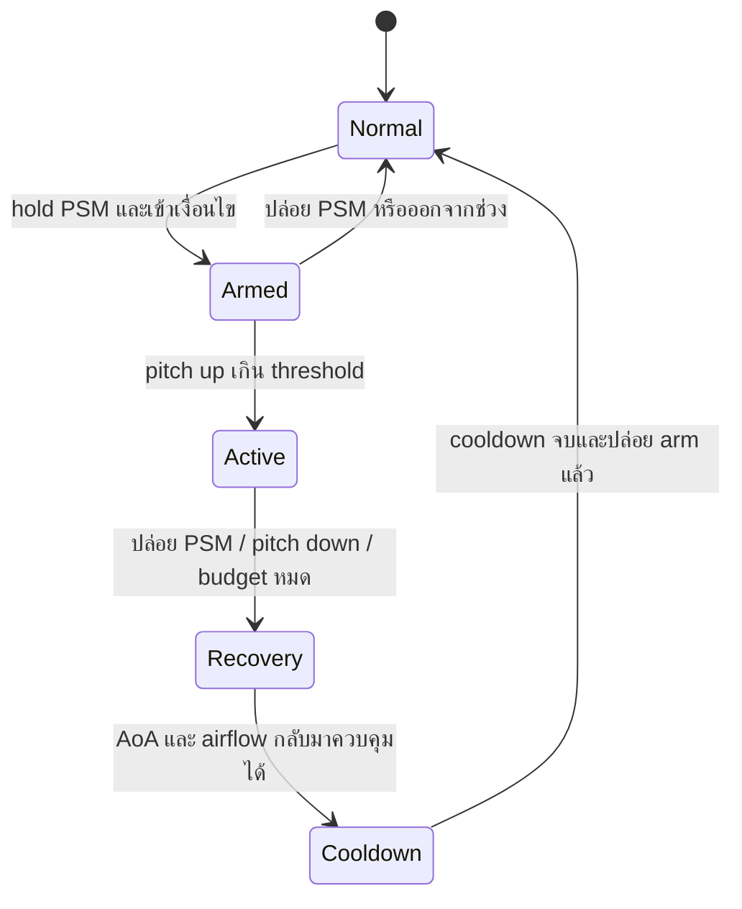

# 04 — High-G, Airbrake, Cobra และ Thrust Vectoring

[กลับ Master Plan](../../MASTER_PLAN.md) · P2 · พึ่ง flight ใน 03 และ input ใน 02

## P2 implementation override · 7 กันยายน 2026

ตามคำขอล่าสุด ผู้เล่นต้องคุมท่าเอง: **hold C + steer** แทน tap-to-assist เวอร์ชันแรก C อย่างเดียวไม่เปลี่ยน pitch/thrust/brake; เข้า active เมื่อ pitch/yaw magnitude >0.35, speed 65–115 m/s, AGL ≥150 m ทุกแกนตอบ player input ตลอด ไม่บังคับให้หยุดที่มุม Cobra; ผู้เล่นเชิดแล้วกดหัวกลับ หรือเลือก plane/ดึงต่อเพื่อ 180° ได้

ปล่อย C, budget 3 s / 360° angular travel, speed <25 m/s หรือ altitude <80 m → recovery ระบบเพิ่มการตามหัวของ velocity ด้วย bounded force แต่ไม่หมุนหัวกลับเอง ผู้เล่นคืนคันบังคับกลางและ W เร่งออก; recovery complete ต้อง nose/path <ประมาณ 17° และ speed >60 m/s ต่อเนื่อง 0.3 s, timeout 6 s ไม่ถือว่าสำเร็จ จากนั้น cooldown 4 s + release ก่อน re-arm ค่าจริงอยู่ `maneuverProfile` ใน `src/game/flight/maneuvers.ts`; ผลตรวจอยู่ [P2 implementation](../phase-2-playground.md)

ข้อความด้านล่างเป็นข้อเสนอเดิมสำหรับขยายต่อ หากขัดกันใช้ override นี้สำหรับ P2

## แยกกลไกให้ชัด

| ระบบ | สิ่งที่เปลี่ยน | สิ่งที่แลก |
|---|---|---|
| Airbrake | เพิ่ม drag, suppress auto-speed thrust | ความเร็วและเวลาฟื้น |
| High-G | เพิ่ม turn authority ภายใน conventional envelope | induced drag สูงขึ้น; ไม่ใช่ post-stall |
| PSM | เปิด high-AoA/nose authority ตาม capability | ความเร็วลดมาก, trajectory ยังไหล, เปิดช่องให้ศัตรู |
| Thrust vectoring | เพิ่ม angular authority จากแรงขับเมื่อ airflow ต่ำ | ถูกจำกัดโดย power, แกนที่รองรับ และ profile |
| Cobra | ผลการบินจาก PSM pitch-up แล้ว recovery | nose หมุนมากกว่า path; ไม่ใช่ animation ย้ายเครื่อง |

ท่าพื้นฐาน barrel roll, loop, Immelmann, Split-S เกิดจากการควบคุมเอง ไม่ต้องมีปุ่มทำท่า High-G ไม่เป็นปุ่มหมุนกลับ 180 องศาสำเร็จรูป และ Cobra ไม่รับประกันว่าจะชนะศัตรูที่บินผ่านไปแล้ว

## Airbrake และ burner

Airbrake กดค้างตาม 02 ใช้เวลา deploy/retract ทดลอง 0.15–0.30 s เพิ่ม drag แบบ smooth; โมเดลแต่ละลำอาจแสดงแผงเบรกหรือผสม control surfaces ต่างกัน ใน simulation เป็น action เดียว ไม่สมมติว่าทุกเครื่องมีแผงเบรกเหมือนกัน

Afterburner ทดลอง reserve ใช้ต่อเนื่อง 6 s, recharge เต็มประมาณ 12 s เมื่อไม่ใช้, เริ่ม recharge หลังพัก 1 s; หมดแล้วต้องมีอย่างน้อย 25% จึงใช้ใหม่ได้ ห้ามกดถี่เพื่อข้าม spool/cost ตัวเลขนี้เป็น resource เกม ไม่ใช่ปริมาณเชื้อเพลิงจริง ไม่ต้องมี fuel system ใน MVP

Airbrake ชนะ burner เมื่อกดพร้อมกัน ไม่ใช้ burner ระหว่าง PSM active ใน baseline; อนุญาตเมื่อเข้าสู่ recovery และหัวเริ่มสอดคล้องกับ path เพื่อเร่งออกจากท่า

## High-G

เงื่อนไขเริ่มทดลอง: command highG พร้อม magnitude ของ pitch/turn มากกว่า 0.35 และ speed 85–180 m/s; peak ใน sweet spot ของรายลำ เพิ่ม rate authority ราว 1.25–1.45 เท่าและ turn drag ราว 1.6–2 เท่าจาก normal profile โดยยังมี AoA fence ของ conventional flight

ต่ำกว่าช่วงให้ authority ลดแบบต่อเนื่อง ไม่ติด/ดับสลับทุก tick ใช้ hysteresis ราว 5 m/s และ blend 0.15–0.25 s High-G ไม่มี cooldown meter แยกใน baseline เพราะความเร็วที่เสียกับ recovery time เป็นข้อจำกัดอยู่แล้ว หากกดค้างโดยไม่มี turn input ไม่เพิ่ม drag ที่เทียบเท่าการเลี้ยวจริง

## PSM state machine

Armed ไม่ยกหัวเครื่องเอง Active ปรับ authority, AoA limits และ drag เท่านั้น ทุกตำแหน่ง/การหมุนยังผ่าน flight integrator ผู้เล่น pitch down หรือปล่อย PSM เพื่อ recover ได้ตลอด

ค่าเริ่มต้นสำหรับ profile ที่รองรับ Cobra:

| Parameter | ทดลอง |
|---|---|
| Entry speed | 75–110 m/s; ไม่ใช้ HUD speed ตรวจเงื่อนไข |
| Entry AGL | อย่างน้อย 150 m เพื่อให้มีโอกาส recover; configurable ใน flight lab |
| Pitch trigger | มากกว่า 0.6 |
| Cobra nose-off-path goal | 70–110°; ไม่บังคับ pose ให้ถึงทันที |
| Active assist duration budget | สูงสุด 2 s แล้วเข้าสู่ recovery |
| Rotation budget | ไม่เกิน 140° สำหรับ Cobra assist; ชุดท่า flip/Kulbit เป็นงานภายหลัง |
| Recovery complete | nose-off-path ต่ำกว่า 20° และ speed มากกว่า 60 m/s ต่อเนื่อง 0.3 s |
| Cooldown | 4 s หลัง recover และต้อง release/re-arm ใหม่ |
| Desired cost | สูญเสีย speed ประมาณ 25–40%; เป็นผลที่ต้องวัด ไม่หักเลขเพิ่มซ้ำกับ drag |

Budget หมดเป็นการเลิก assist และช่วย recover ไม่ freeze controls หรือ snap orientation หาก recover ไม่สำเร็จใน 4 s ให้ลด post-stall authority เต็มที่และกลับไป stall recovery ปกติพร้อม cue; crash ยังเกิดได้ ไม่วาร์ปขึ้นฟ้า Timer ในแผนนี้เป็น **กติกา Arcade ที่เสนอใหม่** ไม่ใช่ข้อเท็จจริงของเครื่องหรือการอ้างว่าโค้ดเดิมทำแบบนี้

## Thrust vectoring และรายลำ

FCS ใช้ `vectoring.axes`, `lowSpeedAuthority`, `powerCurve`, `maxDeflection` จาก profile ไม่ตรวจ `if aircraftId === 'su57'` ใน core F-22 baseline เน้น pitch; Su-57 profile เกมให้ควบคุมหลายแกนได้มากกว่า; F/A-18E baseline ไม่มี thrust-vectoring assist

แยก **ความสามารถเกม** ออกจาก rig animation และข้อมูลจริง: F-22 มีหัวฉีด thrust-vectoring แบบสองมิติที่แหล่งกองทัพอากาศอธิบายไว้; รายละเอียดจริงของ Su-57 ต้องผูก variant และแหล่งอ้างอิงก่อนเผยแพร่ ไม่เรียกมันว่า “3D vectoring จริงทุกแกน” จาก gameplay flag ดู [แหล่งข้อมูล](19-sources-and-decisions.md)

อนิเมชัน nozzle อ่าน control solution ของ FCS เพื่อแสดงผล หาก GLB ไม่มี bone ที่เหมาะสม ให้ capability ทางภาพแจ้งเป็น missing ใน asset validation ไม่ให้ mesh เป็นตัวกำหนด flight physics

## Counterplay และเกณฑ์ผ่าน

- คู่ต่อสู้ที่รักษาระยะสามารถหลีกเลี่ยง overshoot และกลับมายิงผู้ใช้ Cobra ที่พลังงานต่ำได้
- ปืนยังยิงได้ระหว่าง PSM แต่ยิงตามแนว gun จริง; missile ยังต้องผ่าน seeker limits จึงไม่ lock รอบตัว
- วัด Cobra จาก nose rotation มาก แต่ path rotation น้อยกว่า ไม่สรุปจาก AoA หรือ animation อย่างเดียว
- กด PSM ค้างข้าม cooldown ไม่เริ่มท่าใหม่; F/A-18E ที่ไม่มี capability แสดงเหตุผลและไม่เข้าสู่ Active
- ทดสอบทุก transition, press/release ระหว่าง phase, ความเร็วตรง boundary, terrain ต่ำ และ burner/High-G conflicts
- ส่งมอบ P2 เมื่อทำ Cobra แล้ว recover ได้ซ้ำอย่างคาดเดาได้ และการใช้ท่าพร่ำเพรื่อทำให้เสียเปรียบจริงในการดวล
