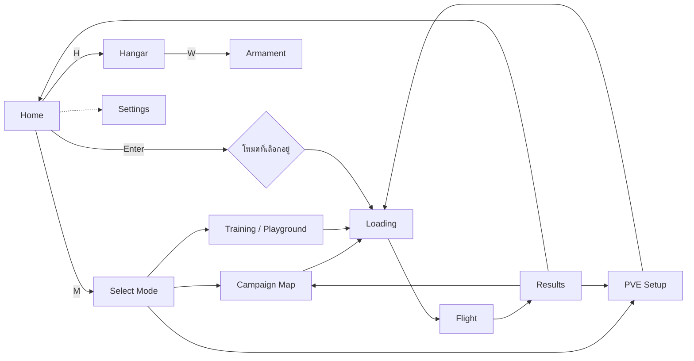

# 20 — Game Shell: Home, Select Mode, PVE Setup และ Settings

[กลับ Master Plan](../../MASTER_PLAN.md) · P3b · อ้างอิงภาพ [example/Design.html](../../example/Design.html) · พึ่ง 06, 09, 11, 15, 21

เอกสารนี้เป็นเจ้าของ **เส้นทางหน้าจอนอก flight** ลำดับการนำทาง โครงวางของ Home/Select Mode/PVE Setup/Settings และ 3D scene ที่ใช้ร่วมกันระหว่างเมนู รายละเอียดโรงเก็บอยู่ใน [06](06-hangar.md) แผนที่ Campaign อยู่ใน [21](21-campaign.md) กติกาโหมด PVE อยู่ใน [09](09-offline.md) สไตล์ภาพอยู่ใน [DESIGN.md](../../DESIGN.md)

## เส้นทางหน้าจอ

| Route เสนอ | หน้าจอ | ภาพอ้างอิง |
|---|---|---|
| `#/` | Home | 1 · Home |
| `#/mode` | Select Mode | 1b · Select mode |
| `#/hangar` | Hangar | 2 · Hangar |
| `#/hangar/armament` | Armament | 2b · Hangar armament |
| `#/campaign` | Campaign Map | 3a · Campaign map |
| `#/pve` | PVE Setup | 3b · PVE setup (ปรับตามโหมดใหม่ ดูด้านล่าง) |
| `#/settings` | Settings | ยังไม่มี mockup |
| `#/flight` | Flight/Match | HUD ตาม DESIGN.md |

Home แทนที่ Hangar ที่ `#/` เดิม Esc ย้อนกลับหนึ่งระดับเสมอ (Armament → Hangar → Home, Campaign/PVE → Select Mode → Home) การกลับจาก flight ต้องลงหน้าที่ผู้เล่นมาจาก ไม่ใช่ Home ทุกครั้ง

## 3D scene เดียวสำหรับทุกหน้าเมนู

Home, Select Mode, Hangar และ Armament ใช้ **Canvas และ aircraft instance เดียวกัน** แต่ละ route ประกาศ camera preset และ scene state ของตัวเองเท่านั้น

| Route | Camera / scene |
|---|---|
| Home | hero shot มุม 3/4 ด้านหน้า เต็มกลางจอ หมุน turntable ช้า |
| Select Mode | กล้องถอยออก (dolly back) และหรี่ scene ลงเหลือราว 40% |
| Hangar | orbit 360° (รวมใต้ท้องเครื่อง)/zoom/reset ได้; stage animation ตามที่ GLB มี clip |
| Armament | ghost airframe เปิด bay ของอาวุธที่เลือก และแสดงโมเดลอาวุธ (สถานะ 28 ก.ย. 2026: ซ่อนเครื่องและแสดงเฉพาะโมเดลอาวุธ, ยังไม่มี ghost/bay) |

- การเปลี่ยน route ในเมนูต้องไม่โหลด GLB ใหม่ และไม่สร้าง WebGL context ใหม่ กล้องเปลี่ยนด้วย transition สั้น ๆ และไม่มี transition เมื่อเปิด reduced motion
- Turntable บน Home เป็น ambient motion ที่หยุดเมื่อ reduced motion และหยุดเมื่อแท็บถูกซ่อน
- Campaign Map และ PVE Setup ใช้ภาพแผนที่ของตัวเอง จึงซ่อน aircraft scene ได้ แต่ไม่ dispose asset ที่ cache ไว้
- การเข้า flight เป็นการเปลี่ยน scene จริง ให้ปล่อย menu render loop และคืนเมื่อกลับ ตรวจ resource count ตาม 17
- Scene ในเมนูยัง render แบบ demand; turntable และ transition เท่านั้นที่ขอ frame ต่อเนื่อง

## Home

ภาพอ้างอิง 1 · Home: โมเดลใหญ่กลางจอ ข้อความทุกชิ้นลอยทับฉาก ไม่มี panel

| ตำแหน่ง | เนื้อหา |
|---|---|
| บนซ้าย | `PROJECT MAVERICK`, callsign ของผู้เล่น, สลับ EN/TH |
| บนขวา | ปุ่ม Settings (ไม่มีใน mockup; เพิ่มเพราะ Settings ต้องมีทางเข้า) |
| ซ้ายล่าง | ACTIVE AIRCRAFT: designation, ชื่อ, role และลิงก์ `CHANGE IN HANGAR →` |
| ซ้ายล่าง | SELECTED MODE: เช่น `PVE · TEAM DEATHMATCH` และบรรทัด map · ขนาดทีม · difficulty |
| ขวาล่าง | `MODE` และ `HANGAR` เป็นปุ่มรอง; `PLAY` เป็นปุ่มหลัก |
| ล่างสุด | สถานะ `OFFLINE · BUILD` และ hotkey hints: Enter Play, M Mode, H Hangar |

`PLAY` เริ่มโหมดที่เลือกไว้ล่าสุดด้วยค่าที่บันทึก ถ้าไม่มีการเลือกหรือค่าเดิมใช้ไม่ได้ (เช่น map ถูกถอด) ให้พาไป Select Mode พร้อมเหตุผล ไม่เริ่ม session ที่ config ไม่ผ่าน validation

Callsign เป็น local preference ที่ 15 เป็นเจ้าของ ค่าเริ่มต้นเป็นชื่อที่ generate ได้ แก้ได้จาก Settings

## Select Mode

ภาพอ้างอิง 1b: การ์ดข้อความใหญ่สองรายการลอยบน scene ที่หรี่ลง

| ลำดับ | เนื้อหา | ปุ่ม |
|---|---|---|
| 01 CAMPAIGN | คำอธิบายสั้น, PROGRESS เช่น `2 / 6`, NEXT mission | `OPEN MAP →` |
| 02 PVE | คำอธิบายสั้น, chips: `TDM · CONTROL POINT · ชิงธง · PRIORITY TARGET · FLYOVER`, ขนาดทีมสูงสุด, `OFFLINE` | `SET UP MATCH →` |
| 03 TRAINING | บรรทัดรอง ไม่ใช่การ์ดใหญ่: Playground, บทฝึก, Flight Lab | `OPEN TRAINING →` |

Mockup มีเฉพาะ Campaign และ PVE แผนนี้เพิ่ม Training เป็นรายการรอง เพราะ Definition of Done ยังต้องการให้ฝึกบินได้โดยไม่เข้า match ดู D15 ใน [19](19-sources-and-decisions.md)

โหมดที่เลือกแล้วแสดง `● CURRENT` การเลือกไม่เริ่มเกมทันที แต่พาไปหน้า setup ของโหมดนั้น

## PVE Setup

ภาพอ้างอิง 3b · PVE setup เป็นฐาน แต่ **แทนตัวเลือก 1v1/FFA ด้วยห้าโหมดทีม** ตามคำขอผู้ใช้ 27 ก.ย. 2026 กติกาแต่ละโหมดอยู่ใน [09](09-offline.md)

| ส่วน | เนื้อหา |
|---|---|
| พื้นหลัง | ภาพ map เต็มจอ (aerial pan ช้า) พร้อม overlay ขอบสนาม, spawn ของทีม, จุด objective ของโหมดที่เลือก |
| หัว | `MODE · PVE` และบรรทัดสรุป เช่น `TEAM DEATHMATCH · 2v2` |
| GAME MODE | `TEAM DEATHMATCH` / `CONTROL POINT` / `ชิงธง` / `PRIORITY TARGET` / `FLYOVER` แต่ละตัวมีคำอธิบายหนึ่งบรรทัด |
| MAP | รายการ map พร้อมแท็ก `READY` / `PLANNED` และโหมดที่ map รองรับ; map ที่ไม่รองรับโหมดที่เลือกแสดงเหตุผลและเลือกไม่ได้ |
| RULES | WEAPONS `GUNS ONLY` / `GUNS + IR`, TIME LIMIT, SCORE LIMIT (ความหมายเปลี่ยนตามโหมด) |
| TEAM SIZE | `1v1` ถึงขนาดสูงสุดที่ผ่าน performance budget; ทีมผู้เล่นเติมด้วย ally bots |
| DIFFICULTY | EASY / NORMAL / HARD พร้อม reaction time และคำอธิบายจาก 08 |
| ROSTER | สองคอลัมน์ ALLIES / ENEMIES: callsign, difficulty, aircraft (กดสลับได้) |
| ขวาล่าง | YOUR AIRCRAFT + `CHANGE IN HANGAR →`, ปุ่ม `START`, บรรทัด MATCH summary |

TDM ที่ขนาด 1v1 คือ duel ของ P4 จึงไม่ต้องมีโหมด Duel หรือ FFA แยก

ตัวเลือกที่ระบบยังไม่มีให้แสดงสถานะตามจริง เช่น `GUNS + IR` เป็น disabled พร้อมเหตุผลจนกว่า P5 ผ่าน Map ที่ยังเป็น `PLANNED` เลือกไม่ได้ ก่อน P4 หน้านี้ยังเปิดได้ แต่ `START` เปิดได้เฉพาะ Free Flight บน Flat Training Range และต้องบอกว่ายังไม่มีบอท

ค่า setup ล่าสุดเก็บใน local preferences (15) และ validate ทุกครั้งที่อ่านกลับ

## Settings

สเปกนี้สรุปกับเจ้าของงานเมื่อ 28 ก.ย. 2026 เจ้าของงานให้ implement โดยไม่ต้องมี mockup ก่อน (ข้ามเงื่อนไขเดิมของหัวข้อนี้) โค้ดอยู่ใน `src/features/settings/` ค่าที่บันทึกอยู่ใน 15 พฤติกรรมกล้องอยู่ใน 11

**โครงหน้าจอ.** Panel อยู่ซ้าย มี tab ด้านบน ใต้รายการมีแถบคำอธิบายของแถวที่เลือกหรือชี้อยู่ และแถบปุ่มลัดใช้ไอคอน Kenney Input Prompts (CC0)
- ในเมนู (`#/settings`, เปิดจากปุ่มเฟืองใน Home และ Hangar): กล้องเลื่อนไปมุม `settings` ให้เห็นเครื่องบินด้านข้าง หัวหันเข้าหา panel อยู่ครึ่งขวาของจอ turntable หยุด ใช้ view offset ของกล้อง ไม่ขยับตัวเครื่องบิน จอแคบกว่า 900px ให้ panel เต็มจอ
- ในเกม: ปุ่ม SETTINGS ในหน้าพักสลับเนื้อหา dialog เป็น panel เดียวกัน ไม่เปลี่ยน hash เพราะเปลี่ยน route แล้ว flight จะ unmount dialog เป็น modal จึงต้องแสดงอยู่ข้างในนั้น HUD ถูกซ่อน ภาพบินที่หยุดค้างอยู่ทางขวาใช้ดูผลของค่าได้ทันที
- Esc ย้อนกลับทีละขั้น: หน้าตั้งปุ่ม → รายการ → หน้าที่เปิดมา (Home, Hangar หรือหน้าพัก)

**ปุ่มลัด.** Q/E เปลี่ยน tab · ↑↓ เลือกแถว · ←→ เปลี่ยนค่า · F คืนค่าแถว · C คืนค่าทั้ง tab · Esc ย้อนกลับ ค่าใช้ทันทีและบันทึกทันที ไม่มีปุ่ม Apply จุด ▪ หน้าแถวแปลว่าค่านั้นต่างจากค่าเริ่มต้น

| Tab | แถว (ค่าเริ่มต้นเป็นตัวหนา) |
|---|---|
| Keyboard & Mouse | Controls **Mouse + Keyboard** / Keyboard only · Mouse mode **Relative** / Stick · Stick frame **Body** / Horizon · Mouse left/right **Roll** / Yaw · Sensitivity 0.5–2.0 (**1.0**) · Invert pitch **Off** · Key bindings (หน้าย่อย) · Afterburner / Airbrake **Hold** / Toggle แถวเมาส์ปิดพร้อมเหตุผลเมื่อเลือก Keyboard only |
| Controller | ยังไม่รองรับ tab เลือกได้แต่แถวทั้งหมดเป็น pending: deadzone, response curve, pitch/roll sensitivity, invert, vibration, button layout, button prompts |
| Camera | Camera roll **Horizon locked** / Aircraft locked · Roll style **Balanced** / Dynamic (แสดง Default และปิดไว้เมื่อ Aircraft locked) · Field of view แนวตั้ง 50–70° (**56**) ค่า dynamic FOV บวกเพิ่มจากฐานนี้ |
| Graphics | Quality preset Low / Medium / **High** / Custom · Render scale **Auto** / 0.6 / 0.8 / 1.0 / 1.2 / 1.5 / 2.0 · Anti-aliasing **On** · Exhaust / Vapor Off / Low / **High** · Frame rate limit 30 / 60 / 120 / **Unlimited** · Show FPS **Off** |
| Audio | ยังไม่มีระบบเสียง แถว pending: master, engine, menu volume |
| Interface | Language · Callsign (≤ 16 ตัว, บันทึกเมื่อกด Enter หรือออกจากช่อง) · UI scale 80–120% (**100**) · Reduced motion **Auto (ตามระบบ)** / On / Off |

**Graphics preset** ไม่ได้เก็บเป็นค่าแยก คำนวณจากค่าย่อย: ตรง Low/Medium/High ก็แสดงชื่อนั้น ไม่ตรงแสดง Custom Show FPS ไม่นับรวม

| | Low | Medium | High |
|---|---|---|---|
| Render scale | 0.8 | 1.0 | Auto |
| Anti-aliasing | Off | On | On |
| Exhaust | Low | High | High |
| Vapor | Off | Low | High |
| Frame rate | 60 | 60 | Unlimited |

- ทุก preset ลดงาน GPU ได้จริง:
  - Low ลดจำนวน ray sample ของ vortex (24 → 12) และ exhaust (ครึ่งหนึ่ง)
  - Off ข้าม effect นั้น ถ้าปิดทั้งสองอย่าง pass จะเหลือแค่ resolve ภาพ
  - Anti-aliasing คือ MSAA 4× ของ render target ใน volume pass เปลี่ยนได้ทันที
- ขอบเขตของแต่ละค่า:
  - Auto คงพฤติกรรมเดิม (`dpr` [1, 1.5]) และใช้ทั้งเมนูกับเกม
  - Anti-aliasing, effects, frame rate และ Show FPS มีผลเฉพาะในเกม ฉากเมนูเปิด AA ไว้เสมอ เพราะค่า AA ของ WebGL context เปลี่ยนภายหลังไม่ได้
- UI scale ใช้ CSS `zoom` กับ overlay ของเมนูและ dialog ในเกม HUD glass คงขนาดเดิม การขยายเกิน 100% ทำได้เท่าที่หน้าต่างมีที่ว่างเหนือขนาดออกแบบ 1280 × 720 (`effectiveUiScale`) เพราะ Hangar และ PVE ที่ 120% บนจอ 1280 × 720 จะซ้อนกัน

**Key bindings.** แต่ละคำสั่งมีปุ่มหลักกับปุ่มสำรอง เก็บเป็น `KeyboardEvent.code`
- ปุ่มเริ่มต้นตาม 02 เปลี่ยนสองจุด:
  - R = Look back (pending: ยังไม่มีระบบกล้องมองหลัง) และไม่มีปุ่มลัด reset flight อีกต่อไป reset อยู่ในหน้าพัก
  - V = Cycle camera mode วน Balanced → Dynamic → Aircraft locked
- Esc และ P ใช้พักเกมเสมอ ผูกกับคำสั่งอื่นไม่ได้ ปุ่ม F1–F12 และปุ่มระบบก็ผูกไม่ได้
- ปุ่มที่ใช้อยู่แล้วจะไม่ถูกเขียนทับเงียบๆ หน้าจอถามว่าจะสลับกันไหม
- Toggle ของ afterburner/airbrake ถูกล้างเมื่อพักเกม เหมือนปุ่มที่กดค้าง

## ข้อความ overlay และ input

- ข้อความทุกชิ้นลอยบน scene โดยใช้ vignette/scrim แบบ gradient ที่ขอบจอ ไม่ใช้ panel ทึบ และไม่ใช้ glow แก้ปัญหาอ่านยาก ตรวจ contrast กับโมเดลสีสว่างทุกลำ
- ทุกปุ่มใช้ได้ด้วยเมาส์และคีย์บอร์ด hotkey เป็นทางลัด ไม่ใช่ทางเดียว; hotkey ของเมนูเป็น input context แยกจาก flight (02) และไม่ทำงานขณะ focus อยู่ในช่องพิมพ์
- สถานะ loading, GLB ล้มเหลวพร้อม retry, WebGL ใช้ไม่ได้ และ save ล้มเหลว อยู่ในหน้าจอที่เกิดเหตุ พร้อมทางกลับ
- ข้อความทุกตัวมีทั้ง `th` และ `en` ตรวจภาษาไทยยาวที่ 1280×720

## งานและเกณฑ์ผ่าน

1. แยก route และ shared menu scene ออกจาก HangarPage ก่อนทำหน้าใหม่
2. Home และ Select Mode ที่พา Play ไป Free Flight ได้จริง
3. ย้าย Hangar เป็น overlay และเพิ่ม Armament ตาม 06
4. PVE Setup ที่แสดงโหมด/map/ตัวเลือกตามสถานะจริงของระบบ
5. Campaign Map shell ตาม 21 (ข้อมูลและ progress ทำงานแม้ยังเล่นภารกิจไม่ได้)
6. Settings ตาม 15 และหัวข้อ Settings ด้านบน (ทำแล้ว 28 ก.ย. 2026)

ผ่านเมื่อเดินทาง Home → Mode → Setup → Flight → กลับหน้าเดิม 20 รอบโดย GLB ไม่ถูกโหลดซ้ำระหว่างหน้าเมนู และ resource count ไม่โต ทุกหน้าใช้ได้ด้วยคีย์บอร์ดล้วน ทุกตัวเลือกที่ยังไม่พร้อมบอกเหตุผลแทนการซ่อนหรือกดแล้วไม่เกิดอะไร
